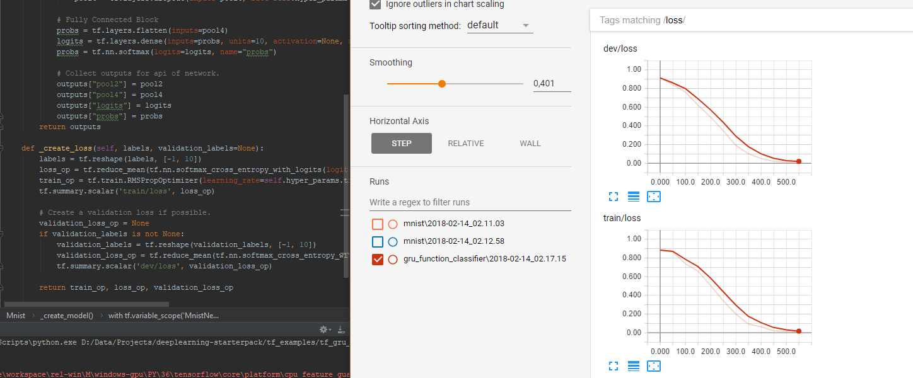

# Deep Learning - Starterpack [](LICENSE)

This repo aims to contain everything required to quickly develop a deep neural network with tensorflow or keras.
It comes with several dataset loaders and network architectures.
If I can find it the models will also contain pretrained weights.
The idea is that if you use existing dataset loaders and networks and only modify them, you will automatically obey best practices and have super fast training speeds.

## Writing your own models

See section 'Simple to use tensorflow' at the end of this document.


## Install

First clone the repository **recursively**!

```bash
git clone --recursive https://github.com/penguinmenac3/deeplearning-starterpack.git
```

Simply create a new python virtual environment (preferably python 3.x) and install the requirements listed in the [requirements.txt](requirements.txt).
Properly install tensorflow-gpu please follow the [official instructions](https://www.tensorflow.org/install/) carefully.


## Running examples

Either use an ide such as pycharm and set your working directory to the keras-starterpack folder.
Or launch your code from the command line like the example bellow.

```bash
# Activate your virtual environment (in my case venv)
# Then do the following
(venv) $ cd /PATH/TO/deeplearning-starterpack
(venv) $ pyhon -m examples.mnist
```

## Datasets

For dataset support I use my own dataset library including bindings to load many popular datasets in a unified format.

However, to use it you will need to initialize git submodules if you did not do a recursive clone:

```bash
git submodule update --init --recursive
```

The dataset loader basically supports **classification**, **segmentation**, **regression** (including **2d- and 3d-detection**) and some visualization helpers.
For details checkout the readme of the project [**here**](https://github.com/penguinmenac3/datasets/blob/master/README.md).

## Models

There are some models implemented to tinker around with.
Most of the implementations are not done by me from scratch but rather refactoring of online found implementations.
Also the common models will come with pre trained weights I found on the internet.
Just check the comment at the top of their source files.

### Tensorflow Models

Every [model](tf_models/model.py) supports setup, predict, fit and export methods.

1. [Alexnet (single stream version)](tf_models/alexnet.py)
2. [VGG 16](tf_models/vgg16.py)
3. GoogLeNet (Inception v3) [TODO]
4. Overfeat/Tensorbox [TODO]
5. ResNet [TODO]
6. SegNet [TODO]
7. Mask RCNN [TODO]
8. monoDepth [TODO]

More non famous models by myself:

1. [CNN for MNIST (Digit Recognition)](tf_models/mnist.py)
2. [GRU Function Classifier](tf_models/gru_function_classifier.py)
3. CNN for LFW (Person Identification) [TODO]

### Keras Models

1. [Alexnet (single stream version)](keras_models/alexnet.py)
2. [VGG 16](keras_models/vgg_16.py)
3. [GoogLeNet (Inception v3)](keras_models/googlenet.py)
4. Overfeat/Tensorbox [TODO]
5. ResNet [TODO]
6. [SegNet](keras_models/segnet.py)
7. Mask RCNN [TODO]
8. monoDepth [TODO]

More non famous models by myself:

1. [CNN for MNIST](keras_models/mnist_cnn.py)
2. [CNN for Person Classification](keras_models/tinypersonnet.py)
3. CNN for Person Identification [WIP]

## Examples

Some samples that should help getting into stuff.

### Tensorflow Examples

1. [MNIST](tf_examples/mnist.py)
2. LFW [WIP]
3. Imagenet (Baselines) [TODO]
4. Bounding Box Regression [TODO]
5. Segmentations [TODO]
6. Instance Masks [TODO]
7. Reinforcement Learning [TODO]
8. [GRU Function Classifier](tf_examples/gru_function_classifier.py)

### Keras Examples


Notebooks:
1. [MNIST Notebook](keras_examples/mnist.ipynb)

Code:

1. [MNIST](keras_examples/mnist.py)
2. LFW [WIP]
3. Imagenet (Baselines) [TODO]
4. Bounding Box Regression [TODO]
5. Segmentations [TODO]
6. Instance Masks [TODO]
7. Reinforcement Learning [TODO]

On non publically availible data:
(however can be used on your own data)

1. [Simple Classification (Folder per Class)](keras_examples/tinypersonnet.py)


## Simple to use tensorflow


### Predefined Models and losses

There are pre-implemented models.
Which can be easily glued together in a model function.
`mode` is a `tf.estimator.ModeKeys` to be Estimator compatible.

```python
from tf_models.mnist import create_loss, create_model

def my_model_fn(features, labels, mode, hyper_params):
    model = create_model(features, mode, hyper_params)
    losses = create_loss(model, labels, mode, hyper_params)
    train_op = None

    if mode == tf.estimator.ModeKeys.TRAIN:
        train_op = tf.train.RMSPropOptimizer(learning_rate=hyper_params.train.learning_rate,
                                     decay=hyper_params.train.decay).minimize(train_losses[0])
    
    return model, losses, train_op
```

### Quick Model Definition

Simply implement a create_model function.
This model is only a feed forward model.

The model function returns a dictionary containing all layers that should be accessible from outside and a feed_dict prepopulated with e.g. hidden states for rnns.

```python
def create_model(input_tensor, mode, hyper_params):
    model = {}
    l2_weight = 0.0
    with tf.variable_scope('MnistNetwork') as scope:
        if mode == tf.estimator.ModeKeys.EVAL:
            scope.reuse_variables()

        # TODO Your model should go here
        model["logits"] = input_tensor
        model["probs"] = tf.nn.softmax(logits=model["logits"], name="probs")
    return model
```

### Quick Loss Definition

```python
def create_loss(model, labels, mode, hyper_params):
    mode_name = utils.mode_to_str(mode)

    losses = []
    
    # Add a loss (also to tensorboard)
    loss_op = ...
    losses.append(loss_op)
    tf.summary.scalar(mode_name + '/loss', loss_op)

    return losses
```

### TFRecord Integration

Fast training speed can be achieved by using tf records.
Actually the api only supports using tf records, to enforce usage for optimal performance.

```python
def generate_data_fn():
    base_dir = "data/mnist"
    train_data = mnist(base_dir=base_dir, phase=PHASE_TRAIN)
    validation_data = mnist(base_dir=base_dir, phase=PHASE_VALIDATION)
    return train_data, validation_data

train_features, train_labels, validation_features, validation_labels = load_data(hyper_params, generate_data_fn, data_tmp_folder)
```

### Tensorboard Integration

Tensorboard integration is simple.
You just have to define a summary (e.g. a summary scalar for the loss) and it gets added to the tensorboard.
No worries when to summarize and how to call it and merging.
Simply define your summary and the rest is handled by the meta model in the fit method.



### More details

More details can be found in the tf_examples or tf_models. Mnist is a simple example for starters.
